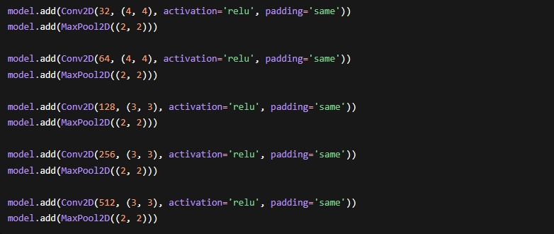
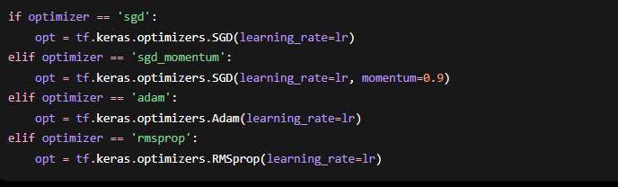
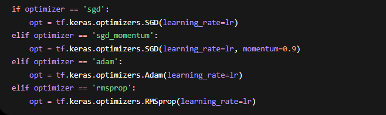
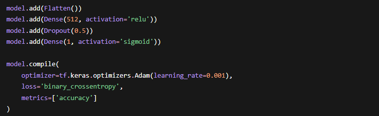

# Pneumonia Detection from Chest X-Rays with CNNs

## Overview

Deep learning project for pneumonia detection from chest X-ray images, comparing custom CNNs, transfer learning, fine-tuning, binary classification, and multi-class classification.

## Technical Highlights

- CNN without transfer learning.
- ResNet50V2 transfer learning and fine-tuning.
- Binary normal/pneumonia classification.
- Multi-class normal/bacterial/viral classification.
- Precision, recall, F1, confusion matrix, and PR-curve evaluation.

## Tech Stack

Python, TensorFlow, Keras, ResNet50V2, scikit-learn, Matplotlib, Seaborn

## Results

- Binary best test accuracy: 95.62%.
- Precision: 0.9896.
- Recall: 0.9183.
- F1 score: 0.9526.
- Multi-class test accuracy: 82.95% with weighted F1 score 0.8259.

## How to Run or Review

- Install requirements: `pip install -r requirements.txt`.
- Download the Kaggle Chest X-Ray Pneumonia dataset.
- Update dataset paths in the scripts under `scripts/`.
- Run the desired training/evaluation script.

## Repository Notes

- This repository is prepared as a clean public GitHub portfolio version.
- Original course reports that contain student IDs or private details are not committed.
- The committed material focuses on source code, safe visuals, result screenshots, and a technical summary.

## Visuals

